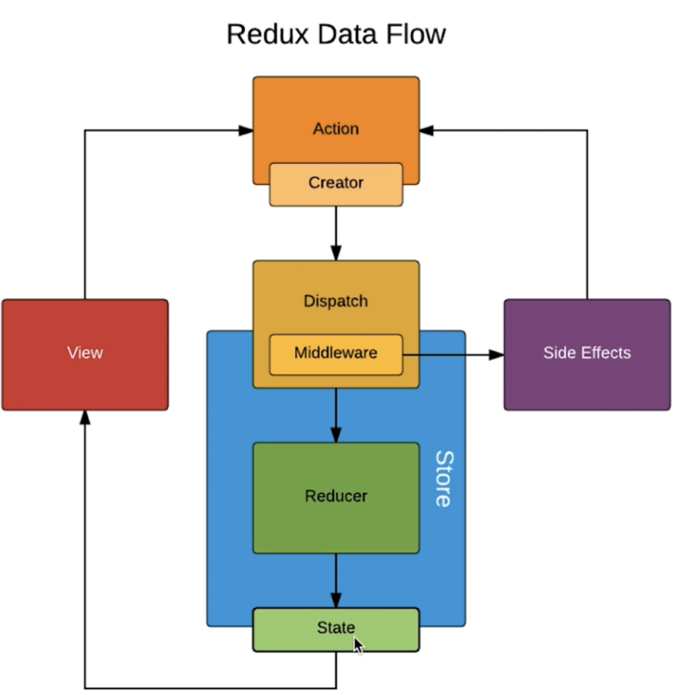

# React Study

- 声名式开发

命令式开发（jQuery）

- 面向数据开发

- 组件化编程

- 单向数据流

- 视图层框架

- 函数式编程

（面向测试编程）

更好的做前端的自动化测试

> 2013年FaceBook推出的函数式编程框架

React Fiber（React 16版本）

## 基本内容

- create-react-app
- 组件化思维
- jsx
- 开发调试
- 虚拟DOM
- 生命周期
- React-transition-group
- Redux
- Antd
- UI、容器组件
- 无状态组件
- redux-thunk
- redux-saga
- style-components
- Immuatable.js
- redux-immutable
- axios

## 环境搭建

Create-react-app

`npx create-react-app`

## 基础语法

React中必须引入react是因为需要编辑jsx

`import React from 'react';`

### JSX

`{ /* js表达式 */}`

**html标签**

`<div></div>`

- JS中编写HTML，

- Fragment
（自定义组件）
用于占位符，实现最外层没有标签包裹的情况

`import React, { Fragment } from 'react'`

`<Fragment><div>666</div></Fragment>`

- 自定义组件直接使用标签名，且首字母大写

`import Input from 'antd'`

`<Input />`

- 注释

`{/* 注释 */}`

```
{
    // 注释
}
```

### 响应式设计

** immutable **

state 不允许我们做任何的改变

```

// ES6 return 简写
this.setState(() => ({
    toDoItem: value
}));

```

### 事件绑定

`onClick = { this.handleClick }`

## 组件拆分

### 组件化

- UI组件和容器组件

- 无状态组件

只有render函数的组件

### 组件传值

- 父 =》子

属性传值

`data = { data }`

`props.props.data`

- 子 =》父

`this.props.handleClick`

### props校验

// props的校验
ReduxItem.propTypes = {
    index: PropTypes.number,
    item: PropTypes.oneOfType([PropTypes.string, PropTypes.number]) // 包含某一个
};

// 默认值
ReduxItem.defaultProps = {
    item: 'toDoItem'
};

## 生命周期

生命周期函数指在某一个时刻组件会自动调用执行的函数

- Initialization:初始化阶段。
- Mounting: 挂载阶段。
- Updation: 更新阶段。
- Unmounting: 销毁阶段

### Mounting

componentWillMount() {
    console.log('componentWillMount----组件将要挂载到页面的时刻')
}

componentDidMount() {
    console.log('componentDidMount----组件挂载完成的时刻执行')
}

::: tip
componentWillMount和componentDidMount这两个生命周期函数，只在页面刷新时执行一次，
而render函数是只要有state和props变化就会执行
:::

## Redux

Redux = Reducer + Flux

数据层框架

### 规则

- State 是只读的，唯一修改它的方式是 actions。
- 更新的唯一方式：dispatch(action) -> reducer -> new state。
- Reducer 函数必须是“纯”的 —— 不能修改它的参数，也不能有副作用（side effect）。
- 只有store能够改变自己的内容

### 使用

- createStore
- store.dispatch
- state.getState()
- state.subscribe()

## react-redux使用

要做到这一点，要用到 react-redux 库的两样东西：
 
- Provider 的组件

通过Provider包装整个应用，使得每个组件都能访问 Redux store

在 index.js 里，引入 Provider 然后用它把 App 的内容包装起来。store 会以 prop 形式传递。

```javascript

import { Provider } from 'react-dedux';
import { store } from 'react-dedux';

const store = createStore(
    reducer, 
    window.__REDUX_DEVTOOLS_EXTENSION__ && window.__REDUX_DEVTOOLS_EXTENSION__() // 调试redux用的
);
...

const App = () => {   
    <Provider store = { store }>
        <App />
    </Provider>
}

```

- connect 函数。
 
 我们需要在我们的组件使用 connect 函数来访问 store
 
 react-redux中的connect方法将store上的getState 和 dispatch 包装成组件的props。
 
 connect() 接收四个参数，它们分别是 mapStateToProps ， mapDispatchToProps， mergeProps 和 options 。
 
 ```javascript
// 使用connect函数包装起来
const mapStateToProps = (state) => {
    return state
};
// 简写
const mapStateToProps = (state) => ({
    state
});

const mapDisPatchToProps = {
    getInputChangeAction,
    addToDoAction,
    delToDoAction,
    getListAction
};
// 高阶函数(connect)，传入一个组件，包装后继续返回这个组件
export default connect(mapStateToProps, mapDisPatchToProps) (ToDoList);
```

### 进阶

actionTypes的拆分

将action.type常量化

## redux-thunk 中间件

(用于异步代码拆分)

对于action和store之间的中间件

**对于dispatch方法的封装;**
使得action可以为一个方法，并执行该方法

```
import Thunk from "redux-thunk";
import { createStore, applyMiddleware } from "redux";
// applyMiddleware使得可以使用中间件
import { Provider } from "react-redux";

<Provider store={store}>
        <React.Fragment>
            <App/>
        </React.Fragment>
    </Provider>
```



## redux-saga 中间件

## reducer拆分

import combineReducer from 'reducer';
import todoReducer from 'todoReducer';

const reducer = combineReducers({
    todoReducer
})
export default reducer;

## 原理进阶

## 动画

## 实战

- 环境搭建

- 组件

- 登录校验

- 上线1

## git checkout -b master
